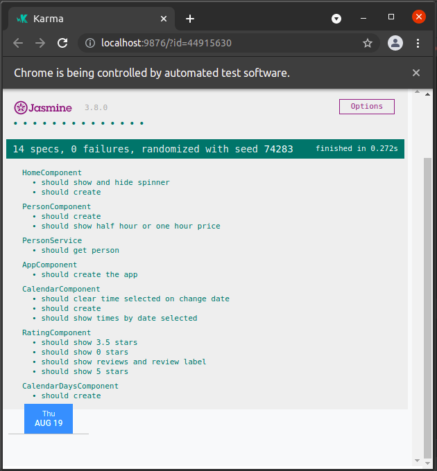

# ZenklubChallenge
Project in production at the link https://zenklub-challenge.web.app/ 

Mobile


Tablet


Desktop


## Project details
The project was created to developing the challenge proposed by Zenklub.

### Technologies used

- Angular version 12 to frontend
- Firebase hosting to store project in production
- Flask with Python 3.8 to return persons and available dates
- Google App engine to store Flask API

## Run project locally

### First install dependencies
Run command in project root directory
```sh
npm install
```

### Start local server
Run command in project root directory
```sh
ng serve
```
After navigate to `http://localhost:4200/`

## Running unit tests

Run `ng test` to execute the unit tests


